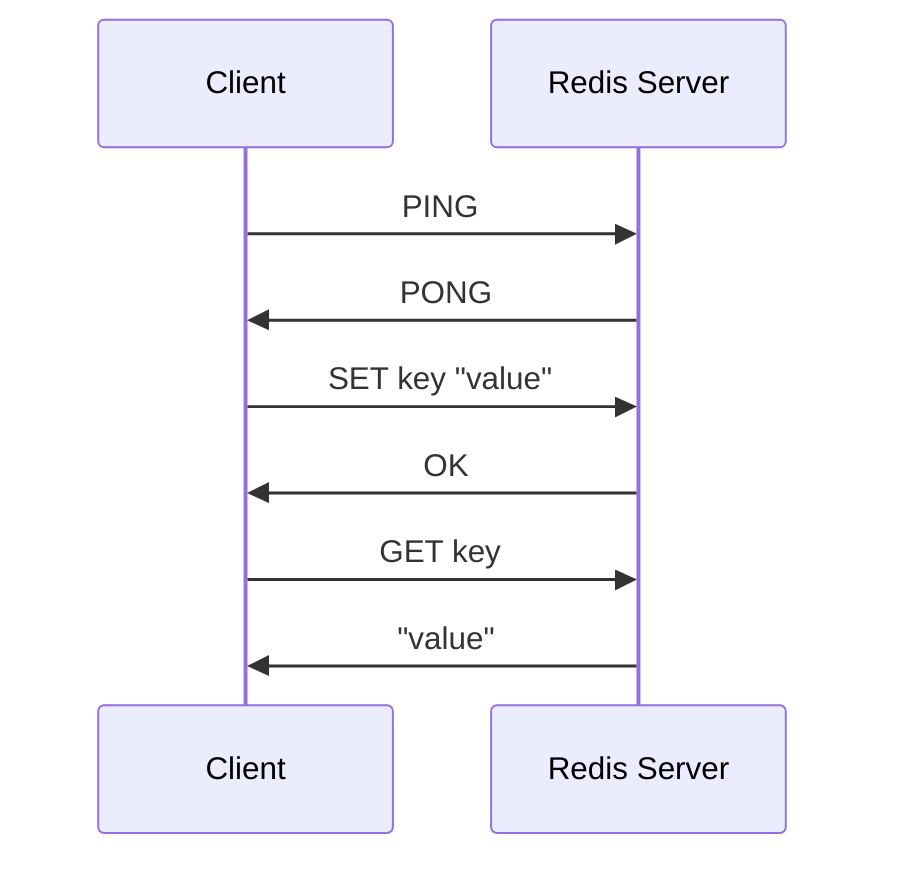

# Rusty KV Store

A Redis-compatible key-value store server implementation written in Rust.

## Overview

Rusty KV Store is a lightweight Redis-compatible server that implements Redis
commands using Rust's async I/O capabilities with Tokio. This project aims to
provide a high-performance, memory-efficient alternative to Redis while
maintaining protocol compatibility.

## Features

- TCP server implementation with async I/O
- Redis protocol compatibility
- Command handling architecture
- Currently implemented commands:
  - `PING` - Test server connectivity
  - `ECHO` - Echo back the provided message

## How It Works 🔍

### Redis Client-Server Communication Diagram 📊



1. **Client** sends a command to the **Redis Server**.
2. **Redis Server** processes the command.
3. **Redis Server** sends back the response to the **Client**.

### Running the Server

```bash
cargo run --release
```

By default, the server listens on `127.0.0.1:6379`.

### Connecting to the Server

You can use the standard Redis CLI or any Redis client to connect to the server:

```bash
# debian/ubuntu
sudo apt-get install socat

# macOS (using Homebrew)
brew install socat

# Connect to the server
socat - TCP:localhost:6379

# Then type commands in RESP format
PING
ECHO Hello World!!
SET key value
GET key
```
