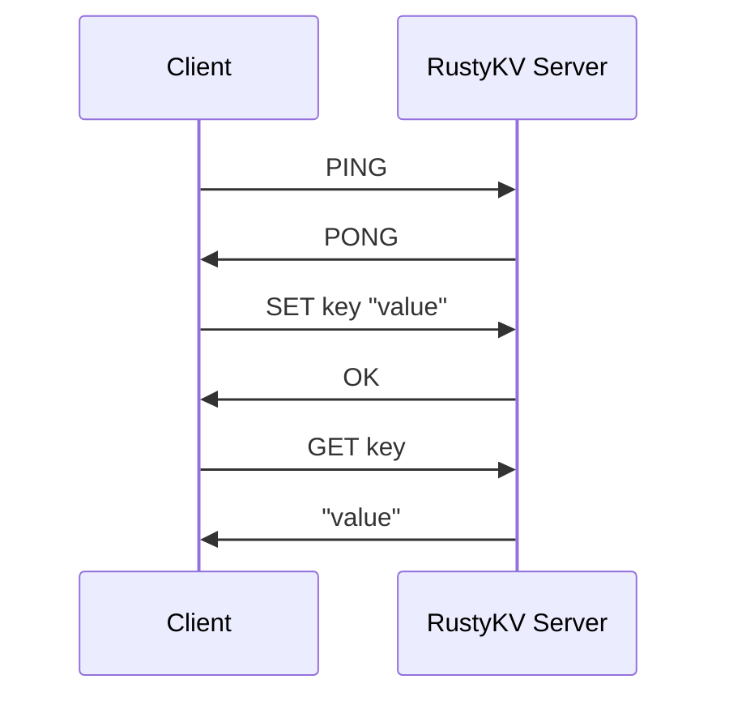

# 🚀 Rusty KV Store

A Redis-compatible key-value store server implementation written in Rust.

## 📖 Overview

Rusty KV Store is a lightweight Redis-compatible server that implements Redis
commands using Rust's async I/O capabilities with Tokio. This project aims to
provide a high-performance, memory-efficient alternative to Redis while
maintaining protocol compatibility.

## ✨ Features

- 🔄 TCP server implementation with async I/O
- 🔌 Redis protocol compatibility
- 🏗️ Command handling architecture
- 📋 Currently implemented commands:
  - `PING` - Test server connectivity
  - `ECHO` - Echo back the provided message
  - `SET` - Set the value of a key
  - `GET` - Get the value of a key

## ⚙️ How It Works 🔍

### 📊 RustyKV Client-Server Communication Diagram



1. **Client** sends a command to the **RustyKV Server**.
2. **RustyKV Server** processes the command.
3. **RustyKV Server** sends back the response to the **Client**.

### 🖥️ Running the Server

```bash
# Run the server using cargo
make run-server
# or
cargo run --release
```

By default, the server listens on `127.0.0.1:6379`.

### 🔗 Connecting to the Server

You can use the standard Redis CLI or any Redis client to connect to the server:

```bash
# debian/ubuntu
sudo apt-get install socat

# macOS (using Homebrew)
brew install socat

# Connect to the server
socat - TCP:localhost:6379

# Then type commands in RESP format
PING
ECHO Hello World!!
SET key value
GET key
```

## 💻 C++ CLI Client

A lightweight C++ CLI client is included to interact with the server directly.

### 🛠️ Building the CLI Client

The client requires the ICU (International Components for Unicode) libraries.

```bash
# Build the CLI client
make build-cli
```

This will compile the client and create a binary at `cli/tmp/main`.

### 🚀 Using the CLI Client

```bash
# Run the CLI client (builds it if needed)
make run-cli

# Connect to local RustyKV server (default: 127.0.0.1:6379)
./cli/tmp/main

# Connect to specific host
./cli/tmp/main 192.168.1.100

# Connect to specific host and port
./cli/tmp/main 192.168.1.100 7000
```

Once connected, you will see a prompt where you can type commands:

```
127.0.0.1:6379> SET mykey "Hello, RustyKV!"
127.0.0.1:6379> GET mykey
127.0.0.1:6379> PING
```

To exit the client, type `exit` or `quit`.

### 🔄 Run Both Server and Client

You can start both the server and client in one command:

```bash
# Run both server and client in parallel
make run
```
